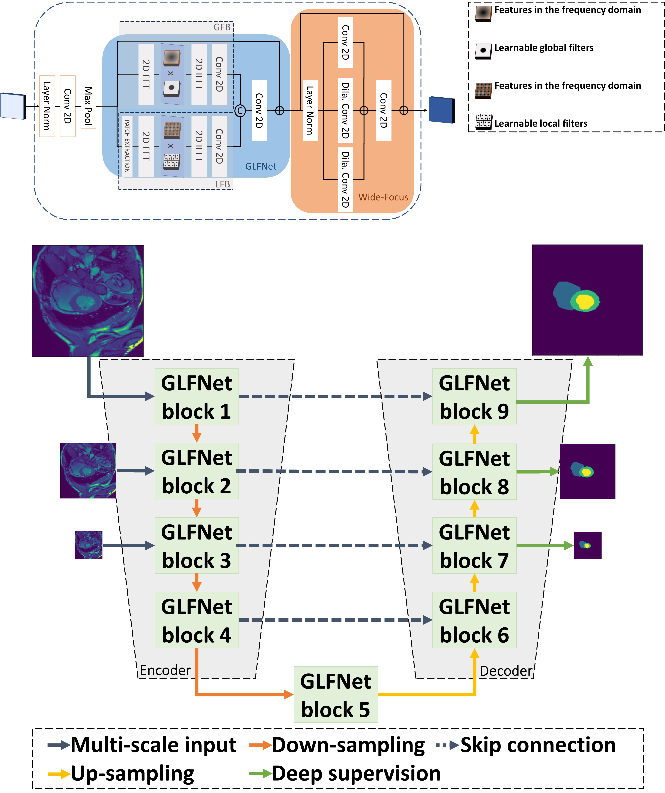

# GlobalLocalFilterNetworks
Official implementation of " GLOBAL-LOCAL (FREQUENCY) FILTER NETWORKS FOR EFFICIENT MEDICAL IMAGE SEGMENTATION" (ISBI2024)

## Abstract
We propose a novel transformer-style architecture called Global-Local Filter Network (GLFNet) for medical image
segmentation and demonstrate its state-of-the-art performance. We replace the self-attention mechanism with a
combination of global-local filter blocks to optimize model efficiency. The global filters extract features from the whole feature map whereas the local filters are being adaptively created as 4 × 4 patches of the same feature map and add restricted scale information. In particular, the feature extraction takes place in the frequency domain rather than the commonly used spatial (image) domain to facilitate faster computations. The fusion of information from both spatial and frequency spaces creates an efficient model with regards to complexity, required data and performance. We test GLFNet on three benchmark datasets achieving state-of-the-art performance on all of them while being almost twice as efficient in terms of GFLOP operations.

[[Paper]](https://arxiv.org/pdf/2403.00396)



## Results
The performance is evaluated on Dice (higher is better). Below the results on  the ACDC dataset (for more quantitative results see the paper).
| Method          		        |  Avg. |  RV   |  MYO  |  LV   |
| :---------------------------: | :---: | :---: | :---: | :---: |
| TransUNet        		        | 89.71	| 88.86 | 84.53 | 95.73 |
| Swin UNet    		            | 90.00	| 88.55 | 85.62 | 95.83 |
| CS-UNet    			        | 91.37	| 89.20 | 89.47 | 95.42 |
| nnUNet    			        | 91.61 | 90.24 | 89.24 | 95.36 |
| FCT    			            | 93.02 | 92.64 | 90.51 | 95.90 |
| GLFNet    			        | 93.12 | 92.69 | 90.71 | 95.97 |

## Implementation
For training/evaluation code see [`FCT`](https://github.com/Thanos-DB/FullyConvolutionalTransformer).

## Citation
```bib
@article{tragakis2024glfnet,
  title={GLFNET: Global-Local (frequency) Filter Networks for efficient medical image segmentation},
  author={Tragakis, Athanasios and Liu, Qianying and Kaul, Chaitanya and Roy, Swalpa Kumar and Dai, Hang and Deligianni, Fani and Murray-Smith, Roderick and Faccio, Daniele},
  journal={arXiv preprint arXiv:2403.00396},
  year={2024}
}
```